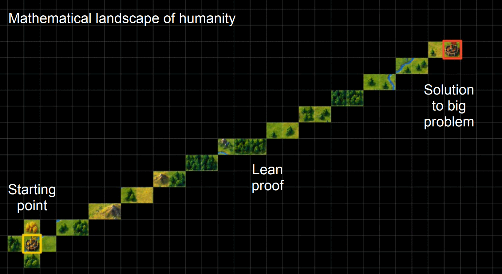
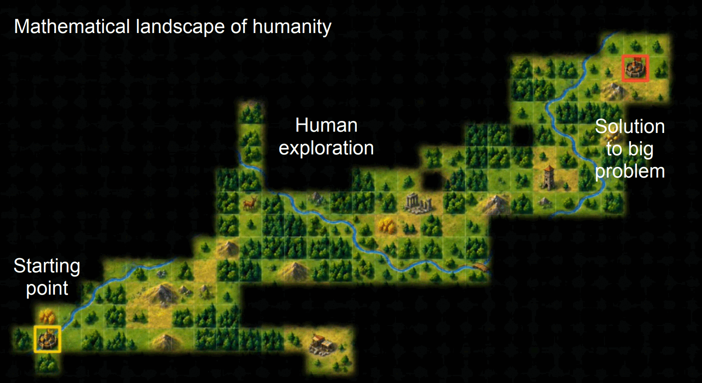
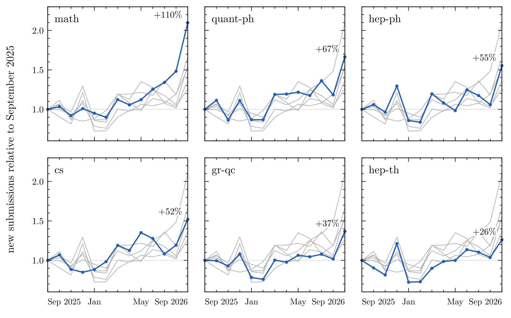

See also the previous post: [You won't understand it when you're older](/blog/you-wont-understand-it-when-youre-older/)

On 8 September, OpenAI announced a proof that the Navier–Stokes equations, which describe the flow of viscous fluids, can develop a singularity in finite time in three dimensions when the fluid is forced smoothly. The proof was found/constructed by O(10⁴) AI agents running on OpenAI's internal model during 8 days for altogether around 100 hours[^openai-ns], at a computational cost of several million dollars[^quanta-ns]. Whether the Lean formalization is correct or not (true to the theme of this post, who knows) is not really the question here, but that of how should we value a proof that only modern-day math preachers, readers of the holy scripture of Lean, can understand.

When Richard Feynman died in 1988, his blackboard at Caltech still had the line "What I cannot create, I do not understand" in its top left corner[^feynman]. I would consider it as a measure of intellectual honesty, as a method for teaching yourself and knowing what you can and cannot do: rebuild a result yourself to truly understand it. I feel academia has long relied on the converse, that whoever created a proof also understands it, and with the proof has contributed to our collective understanding as well. Logically, the converse never followed, but it was a reasonable bet as long as creating the proof was the hard part. Now that machines create too, I think the bet is off, and so is the currency academia pays itself in.

In the previous post I considered if the bad ending of the age of mass AI could be a society that no human understands well enough. Borrowing from the protocols cryptocurrencies use to prove a contribution, let us do a thought experiment on a protocol that pays for understanding instead of output, a *proof of understanding*. I focus on academia, and on mathematics in particular, because there the transition has already visibly begun.

## Cleaning up the overhang

Large language models have been able for some time to solve problems that were considered extremely hard (within this frame of thought, still are). David Bessis argues that they are in a unique position to harvest what he calls the Overhang, "the unrealized capital gains of past mathematical creativity", essentially results that only need somebody to connect dots already present in the literature, which a model trained on the whole corpus is in a far better place to do than any human[^bessis]. However, the proofs these models produce can be incredibly long and nearly impossible for humans to follow.

This can also be described by the concept of "fog of war", which AI-driven proofs don't clear on the way to the big results[^fog]. AI manages to take a direct path and exposes little of the surroundings in which humans would have wandered to prove the claim. Because of this, we miss the chance of learning more in depth, by proving too efficiently. I feel an unworded part of the problematic feeling with AI proving Millennium-level problems is that when Navier–Stokes and the other Millennium problems were given a cash prize, a primary part of the point was that the solution would deepen our understanding of the field along the way to the solution. Proving the actual result, the crowning jewel of all the work, is after all only the jewel on top of the crown which no more gets manufactured. The work and understanding are not complete.

We have historically considered proving to be the hard part, or at least the most time-consuming one -- things like polishing up the proof, presenting it at conferences, and putting it into a textbook in canonicalized form have been secondary. Tao draws the same chain as five stages, from generating a proof to verifying it, explaining it, publishing it and finally canonicalizing it, "of which only the first was ever an explicit goal of the community", and expects "proof indigestion" all along it once AI makes the first stage cheap[^tao]. The proof economy, in which mostly proving paid, is what has driven mathematics. Bessis calls it the theorem economy, and warns that "if theorem-proving remains their only official currency, all research mathematicians run the risk of becoming demonetized in the course of the next few years"[^bessis].

## Getting rich in the academic economy

Back in 1994 William Thurston wrote a sentence that one should compare with Feynman's: "The measure of our success is whether what we do enables *people* to understand and think more clearly and effectively about mathematics."[^thurston] That measure was never easy to observe, so the currency actually paid has been the proofs, and the papers that carry them. What is new is that this currency is now being devalued from the outside. Anything that acts as a currency must be scarce, allowing it to be valuable (of course, not everything that is scarce is valuable). The proofs are becoming less scarce, and hence their role as a currency is dwindling. What is becoming scarce, and what increasingly takes the largest part of the time in research (also in theoretical physics, my main field), is understanding and verifying the results. The academic currency is shifting shape, and the proxies built on top of the old one are losing value.

In my mind, the value of a scientist has always been what they contribute to our collective understanding of the world. Commercial applications are rewarded later with money, so the people who make them have a natural reward system already in place. The reward for basic science is the understanding you contribute to the field, and since that cannot be observed directly, we have set up proxies: publication counts, the h-index[^hirsch], status such as being a professor or a lecturer, publishing books, and so on. However, they have only ever been proxies.

Of course, the proxies were already broken to an extent: for example, citation circles and self-citation existed before AI, and the h-index's correlation with scientific awards in physics fell from 0.34 in 2010 to zero by 2019[^koltun]. Now the proxies are becoming visibly broken. In math, arXiv received 110% more new submissions in September 2026 than in September 2025; hep-ph and quant-ph jumped less, but probably still statistically meaningfully (I have not performed a t-test and the data was collected and processed by Claude ;))[^arxivstats]. Submission counts cannot tell who or what wrote the papers, but I find it almost certain that this is science being fast tracked with LLMs. If papers multiply this fast while the number of people who understand them does not, every paper and every citation says less.

So, what could replace the proxies? Cryptocurrencies had to solve a version of the same problem from scratch: how to let strangers prove that they contributed something real, in a way that everybody can check, so let's draw some analogies.

## Mining for citations

The original purpose of what is now called "proof of work" was to stop email spam. Cynthia Dwork and Moni Naor proposed in 1992 that every sender should solve a small mathematical puzzle with their computer, which would not affect usual people sending emails in any sensible way but would be costly for spammers[^dworknaor]. The trick is that the puzzle is expensive to solve and cheap to check. Bitcoin later used the same trick to secure a shared ledger, with puzzles that are deliberately useless[^nakamoto].

For academia, the proof of work has been that you generate a proof, develop a model, do a data analysis or collect the data. Unlike a hash, that work has by no means been meaningless, and you got rewarded for it with status, and with a higher h-index if you produced papers that were valuable for the community and got cited (organically). It worked for the same reason: a hard proof was expensive to make and, by comparison, cheap to check, and nobody without a deep understanding of an area could produce one. 

AI has inverted the costs. In Thomas Koberda's words, "eliciting sophisticated mathematical work may require little expertise, while detecting a defect in that work may require a great deal"[^koberda]. Spam protection fails the moment producing becomes cheap for the spammer, and as a protocol it was crude anyway: it shows that you have done the work, and none of the knowledge you have.

The second protocol, "proof of stake", is closer to what academia does when it reviews. A validator locks up some of their property to earn the right to vote on what enters the ledger. If they make valid decisions they are rewarded, and if they misuse the power, part of the stake is destroyed or "slashed". Posting work as an academic, you take the credit and say: I have done this, this is a scientific publication, it should be questioned and peer-reviewed to the max, so you are staking a part of your own reputation. If the work is questionable and you have claimed it to be good, you get slashed; if it is good, you get citations and status (to a first approximation). Vouching for somebody else's work as a co-author or referee is the same, even if referees are usually anonymous and stake less. Since May, arXiv has made the analogy literal: authors whose submissions show, with evidence beyond a reasonable doubt, that they did not check what a language model generated, such as hallucinated references, are banned for a year, and afterwards every submission must first be accepted at a reputable peer-reviewed venue[^arxivban].

## Show your work!

One more interesting concept we need from cryptography is that of a zero-knowledge proof, which is in a sense the exact opposite of what I would want from a proof of understanding. A zero-knowledge proof is a mathematical way to convince someone that you know something, say, a password, without ever revealing it[^gmr]. Seen this way, an h-index, a prize or a prestigious title behaves like a zero-knowledge credential: it convinces everyone that you know something, yet it teaches them nothing.

Machine-driven Lean proofs are analogously zero-understanding: they hand you every step, still without telling you why those steps were to be taken. An unformalized AI proof of two hundred pages is expensive to check both for correctness and for whether a single human understands it. A proof formalized in Lean, like the Navier–Stokes one, is (somewhat) cheap to check for correctness, but not at all for whether anybody understands it. The checker convinces you that the theorem holds and tells you nothing about why.

Thus, a proof of understanding, as I would define it, should be a verifiable demonstration that a specific, accountable human can reconstruct the plan of an argument[^hamami], defend it under questioning, and pass it on so that others come to understand it too, working the opposite way from a zero-knowledge proof. What you give to academia and to scientific thought (and, in the more general sense, to a society that might become incomprehensible) is understanding for *humans*. Explaining to your peers becomes the currency, and your understanding becomes the scarce resource that gives you status. It could, for example, be an oral examination, in which you show under questions from an audience that you know something, or that you can teach the topic. How exactly this would be applied in academia is obviously a complex problem, for which I have no solution to offer.

The closest existing statement of the idea is Tao's rule of thumb: "a proof that no human can properly explain should be viewed as incomplete, even if it has been formally verified"[^tao]. I agree, but it is a gate, a yes or no for a single paper. What I have in mind is a currency that accumulates to a person and pays for being able to explain and for explaining as such, including results that are not your own. A simpler and more general version of an AI proof would earn credit under it, as also would whoever makes an unreadable 200-page proof understandable to a seminar room[^discourse].

We already have a tendency to love good teachers. One of my and many other people's favorites is [3Blue1Brown](https://www.3blue1brown.com/), who combines extremely intuitive and understandable arguments with amazing visualizations into top-tier math content. Most of the problems there are not research-grade, or have not been for some time, but that does not matter. The fact that you gain understanding, that you truly feel "I get what is going on", is the beautiful part. That is the human aspect of mathematics we want to retain.

As a cherry on top, in Bitcoin's proof of work, the results of the puzzles are completely useless, knowingly discarded. In a proof of understanding, *the work **is** the valuable part*. Not only do we avoid wasting resources, we gain by doing the work. Checking understanding is expensive, because it takes another human mind, but here the verifier's cost is also the payoff: the hour spent questioning a speaker is an hour in which the audience learns.

## We had a ~~good~~ mediocre thing going (which would not last)

There are, of course, questions about how proof of understanding would really work, and whether it would even make sense. I can't answer them fully, for this is mostly a thought experiment, but a few objections deserve a reply.

The first objection is the obvious one: AI can explain too. In the previous post I said that, in my opinion, explaining is one of the best things to use it for, and a language model can already write a decent explainer on demand, and may soon write one of 3Blue1Brown's grade. But the explanation text is not what is scarce. What is scarce is an accountable human who demonstrably understands, and who can show it under live questioning. A text is evidence of that only if somebody can stand behind it.

Would proof of understanding be gamed too? Obviously it could be and would be, by smart people and smart users of AI or whatever other tools they have available. Goodhart's law applies here as anywhere: when a measure becomes a target, it ceases to be a good measure[^goodhart]. There are ways to make it harder, and I don't want to claim more than that such a protocol could be less gameable than the current ones. It would also be slow, but slowness may be the point: in a proof of work, a cost that cannot be faked is what makes the protocol work. To be honest, if such a shift of currency happened, it probably would not happen as a rigorous protocol at all, but slowly, in our own perception of the value we produce by doing science.

The objection I take more seriously is that such a measure would reward talkers over thinkers. As an example, Grigori Perelman posted his proof of the Poincaré conjecture as terse preprints in 2002–03, and much of the work of making it more understandable was done by other people such as Kleiner and Lott, and Morgan and Tian[^perelman] (by the way, if the Navier–Stokes proof stands, humans and computers are now 1–1 on the Millennium bench, yet that might change soon). However, explaining doesn't have to be just talking. A written explanation, like a simplified proof, counts through the person who can defend it when asked. A terse result that others make understandable still contributes understanding, but mainly through the explainers, and the credit should perhaps be shared with them.

A further objection is that all of this is about mathematics, and I agree that the case for the more applied sciences is probably different, because the "softer" you go in the sciences, the more the human component is in play. The truth of a mathematical theorem doesn't care about humans, only about axioms, and the system within which you work is rigid. Even so, the "human value" of the proof does care, which brings me to social topics: I feel it is extremely fruitful at the moment to create new models of social phenomena, since somehow these are models that only humans can grasp fundamentally well. I feel AI can only repeat the human condition, while only by living that condition can you understand what you are living in. I therefore expect for such societal models that the proof economy erodes later, if at all.

## One for all

Feynman's blackboard had a second line below the more famous one: "Know how to solve every problem that has been solved." In the proof economy that looked like a goal for a starting student, to understand their field from the bottom up, with the prestige reserved for the problems nobody had solved. If the machines keep solving problems in increasing amounts, knowing how to solve problems that have already been solved might become the game in its entirety. For an age of proof abundance, what I cannot explain, I do not understand, and what no human can explain, we do not understand. Understanding could become a strange, almost an inverted type of currency: scarce because it takes time to produce, yet growing every time somebody spends it.

See also the final post in this series: [to appear].

[^openai-ns]: OpenAI, "On the Navier–Stokes Millennium Prize Problem" (8 September 2026, updated 10 September), <https://openai.com/index/navier-stokes-solution/>; the paper "Finite Time Blowup for Navier–Stokes", <https://cdn.openai.com/pdf/32d9f210-8b73-45e0-91bc-82a30aef8a9a/navier-stokes.pdf>; the Lean certificates, <https://github.com/openai/NavierStokesAndEuler>. Clay Mathematics Institute, statement of 11 September 2026, <https://www.claymath.org/news/navier-stokes-announcement/>.
[^quanta-ns]: K. Kakaes, "AI Has Solved One of Math's \$1 Million Millennium Prize Problems", *Quanta Magazine* (8 September 2026), <https://www.quantamagazine.org/ai-has-solved-one-of-maths-1-million-millennium-prize-problems-20260908/>.
[^feynman]: Caltech Archives and Special Collections, Caltech Images Collection, "Richard Feynman's blackboard at time of his death" (1988), ID 1.10-29, <https://digital.archives.caltech.edu/collections/Images/1.10-29/>.
[^bessis]: D. Bessis, "The fall of the theorem economy: How AI could destroy mathematics and barely touch it", *Substack* (21 April 2026), <https://davidbessis.substack.com/p/the-fall-of-the-theorem-economy>, "Caveat #3: The Overhang".
[^fog]: D. Louapre, thread on X (14 September 2026), <https://x.com/dlouapre/status/2099470963469381883>; J. Nättilä, thread on X (15 September 2026), <https://x.com/joonas_nattila/status/2099866177073819945>, whose slides carry the labelled pictures below.
[^tao]: T. Tao, "Mathematics in the age of AI", arXiv:2608.16753 (2026), <https://arxiv.org/abs/2608.16753>: the five stages in section 6 and figure 4, proof indigestion in section 7, the rule of thumb in section 8.
[^hirsch]: J. E. Hirsch, "An index to quantify an individual's scientific research output", *PNAS* 102(46), 16569–16572 (2005), <https://doi.org/10.1073/pnas.0507655102>.
[^thurston]: W. P. Thurston, "On proof and progress in mathematics", *Bulletin of the AMS* 30(2), 161–177 (1994), <https://arxiv.org/abs/math/9404236>.
[^koltun]: On gaming: M. Fire and C. Guestrin, "Over-optimization of academic publishing metrics: observing Goodhart's Law in action", *GigaScience* 8(6), giz053 (2019), <https://doi.org/10.1093/gigascience/giz053>. On awards (physics, Scopus data): V. Koltun and D. Hafner, "The h-index is no longer an effective correlate of scientific reputation", *PLOS ONE* 16(6), e0253397 (2021), <https://doi.org/10.1371/journal.pone.0253397>.
[^arxivstats]: arXiv's monthly statistics per archive, <https://arxiv.org/year/math/2026> and likewise for the other archives, retrieved 1 October 2026. New submissions with that primary archive, cross-lists excluded, September 2025 → September 2026: math 4,252 → 8,919, quant-ph 1,099 → 1,830, hep-ph 476 → 740, cs 12,840 → 19,493, gr-qc 424 → 580, hep-th 405 → 511.
[^dworknaor]: C. Dwork and M. Naor, "Pricing via Processing or Combatting Junk Mail", *CRYPTO '92*, LNCS 740, 139–147 (1993), <https://doi.org/10.1007/3-540-48071-4_10>.
[^nakamoto]: S. Nakamoto, "Bitcoin: A Peer-to-Peer Electronic Cash System" (2008), <https://bitcoin.org/bitcoin.pdf>.
[^koberda]: T. Koberda, "Training Mathematicians in the Age of AI: Intellectual Agency, Cognitive Offloading, and the PhD Thesis", arXiv:2609.28140 (2026), <https://arxiv.org/abs/2609.28140>.
[^arxivban]: T. G. Dietterich, chair of arXiv's computer science section, thread on X (14 May 2026), <https://x.com/tdietterich/status/2055000956144935055>: "If a submission contains incontrovertible evidence that the authors did not check the results of LLM generation, this means we can't trust anything in the paper. The penalty is a 1-year ban from arXiv followed by the requirement that subsequent arXiv submissions must first be accepted at a reputable peer-reviewed venue. Examples of incontrovertible evidence: hallucinated references, meta-comments from the LLM […]"
[^gmr]: S. Goldwasser, S. Micali and C. Rackoff, "The Knowledge Complexity of Interactive Proof Systems", *SIAM Journal on Computing* 18(1), 186–208 (1989), <https://doi.org/10.1137/0218012>.
[^hamami]: Y. Hamami and R. L. Morris: "understanding a proof amounts to rationally reconstructing its underlying plan". "Understanding in mathematics: The case of mathematical proofs", *Noûs* 58(4), 1073–1106 (2024), <https://doi.org/10.1111/nous.12489>.
[^discourse]: For example *Mathematical Discourse*, a peer-reviewed video journal for research talks, <https://www.mathematicaldiscourse.org/>.
[^goodhart]: Named after the description given by C. A. E. Goodhart, "Problems of Monetary Management: The U.K. Experience", *Papers in Monetary Economics* I (Reserve Bank of Australia, 1975), reprinted in *Monetary Theory and Practice* (Macmillan, 1984), <https://doi.org/10.1007/978-1-349-17295-5_4>.
[^perelman]: G. Perelman, arXiv:math/0211159 (2002), <https://arxiv.org/abs/math/0211159>; arXiv:math/0303109 (2003), <https://arxiv.org/abs/math/0303109>; arXiv:math/0307245 (2003), <https://arxiv.org/abs/math/0307245>. B. Kleiner and J. Lott, "Notes on Perelman's papers", *Geometry & Topology* 12, 2587–2855 (2008), <https://doi.org/10.2140/gt.2008.12.2587>. J. Morgan and G. Tian, *Ricci Flow and the Poincaré Conjecture* (Clay Mathematics Monographs 3, AMS, 2007), <https://bookstore.ams.org/view?ProductCode=CMIM%2F3>.
