.")

Nerds have ridiculous hobbies and competitions; here's one: biannually, the high school advanced math exams are held. These exams require the students to answer 10 questions out of 13 possible ones, and they have 6 hours of time to do so. Extra details and the precise ruleset can be found here[^rules]. This exam decides the students' fate for maths grades in applying to higher education.

Now, physicists are not the most athletic people, but consider running the test as a "Cooper"-version[^cooper], where the goal is to complete as much of the exam as possible in 12 minutes. This is precisely the competition I have been running biannually for the last three years. Out of the possible maximum of 120 points, the current historical record is 63 points, although years are not alike and variation is clearly visible. Even so, nobody has yet gotten enough points for two of the highest grades, E(ximia) and L(audatur) in 12 minutes. The competition also uses a somewhat different ruleset from the usual exam, mostly in favor of the exam takers: by the current set of rules, since the competition is not dead serious in any sense, for example any symbolic calculators are allowed for the second part of the exam, and corners are allowed to be cut within reason to get to the answers faster. The grading has not been standardized over the years except for the fact, that the official guidelines for grading, "Hyvän vastauksen piirteet", "Features of good solutions", have been used as the backbone of grading, and it has always been me doing the grading. For the current competition rules, check out[^cooper-rules].

Naturally one raises the question: what about doing this exam with modern AI? This is the question that I will attempt to answer half-scientifically in this blog post. To be precise, I have recorded below the experimental setup we have used for reproducibility. The attempt has been to run an actual scientific test on the ability of modern language models to answer high school math final exam level questions under immense time pressure. It should be obvious, that essentially any model will saturate the test in 12 minutes, but we shall attempt to go much, MUCH lower than that.

A note is in place: often AI capability is measured by the maximal complexity of tasks completed, not the time it takes to complete them. The obvious reason for this is that if you have enough powerful GPUs, you could dump out tokens faster and faster, making the answers appear faster as well. Therefore, the question is more whether the weights of the model are able to grasp a certain problem and solve it, not how long it takes. Here, we are using standard end-user Claude Code with a Max-level plan and no fast mode. If anything, the test is a proxy of how efficiently such high-school level math problems (which are the most complicated math problems an average fella will encounter in their lives) can be solved by current equipment available for end-users. 

In short, this is what was done. Four Claude models, Haiku 4.5, Sonnet 5, Opus 5.5 and Fable 5.1, sit the autumn 2026 exam and, for comparison, the autumn 2025 exam. Note, that Haiku's training cutoff was before the 2025 exam, while the data of the answers to the 2025 exam could in principle be in the training data of the other models. This can act as a part of the control of the control study; however, the author is highly skeptical of such single files affecting the results in any finite way. 

The exams are given to the models in Finnish, without a calculator or any other tool allowed, and with instructions to answer all 13 questions in order. The model is prompted every time from a cold start, so none of the existing AI workflow of the author should contaminate the answers or the process. Sonnet 5, Opus 5.5 and Fable 5.1 run at the effort levels low, medium and high, which Haiku 4.5 does not have; Haiku 4.5 and Sonnet 5 additionally run with thinking switched off, which Opus 5.5 and Fable 5.1 do not allow. That makes 14 configurations, and each is run 10 times per exam for better statistics. Before these, a smaller pilot on the 2025 exam was run to test the setup. 

The model is not told the deadline: its answer is streamed and timestamped, and the answer sheet at a time budget $T$ is whatever had arrived by then. Every answer is graded on its own, by a separate call to a cold-started Opus 5.5, against the official grading guidelines (finalized version for 2025, preliminary version for 2026). The main score counts all 13 answers, maximum 156; next to it is the exam score out of 120, the best five of part A, three of B1 and two of B2, which is the scale of the human record (note however, that humans must optimize in choosing what to solve -- AI does not have to do this). The 2026 exam, written on the day of the runs and after the training data of every model tested, is the main result. The 2025 exam is a control. Everything needed to reproduce this, down to the prompts and the command line, is in the [setup section](#experimental-setup-in-detail) at the end.

**How to read the curves.** *With thinking on, the rise of a curve is not the model solving the questions one after another.* In every one of the 100 runs with thinking on the 2025 exam, as in the pilot, the model thought once and then wrote the whole answer sheet in one go at a roughly constant speed, so *the linear rise is the model writing down what it has already solved.* The steepness of the rise then tells how long the answers are, not how hard the questions were, and the informative numbers are the time to the first word, which is the solving, and the final score, which is the quality. Note however, that if a model made an error along the way and spotted it, that could cause a sublinearity in the plots where it would correct its own answer, but this is not seen in practice; the thinking block seems to almost always already produce the final answer.

Only with thinking off do the solving and the writing happen together, so that the curve shows the model at work. This is why the figures are split by thinking, and why the low-effort comparison draws thinking on as solid and off as dashed lines. Note that assuming a constant or only moderately increasing difficulty level, one could assume that with thinking off, the curve would start rising from T = 0 and rise approximately linearly or slightly quadratically towards the endpoint which is obtained with thinking on. The author also tried giving a more speed-oriented prompt to the models, but this did not cut down thinking time in a meaningful way. 

An important note on AI-usage: this is strongly AI-driven research. The idea and control of results comes from the author, but the workflow is purely AIc, with AI also grading the (around 5300 together) answers, writing the codes, prompts, and various other things. I have checked through these to an extent, but have mostly trusted Opus 5.5 as the main orchestrator to know what to do, with a single audit conducted with Fable 5.1. Hence, take these with a grain of salt.

## The 2026 exam

The numbers, as the mean and standard deviation over the 10 runs of each configuration:

| Configuration | First word (s) | Sheet done (s) | Score /156 | Exam score /120 | Beats 63/120 at (s) | 115/120 at (s) |
|---|---|---|---|---|---|---|
| Haiku 4.5, thinking on | 182 ± 101 | 246 ± 98 | 131.4 ± 5.7 | 110.8 ± 2.6 | 191 | – |
| Haiku 4.5, thinking off | 0.9 ± 0.6 | 94 ± 12 | 127.1 ± 2.0 | 108.6 ± 1.3 | 38 | – |
| Sonnet 5, low | 94 ± 24 | 153 ± 23 | 139.8 ± 2.9 | 114.6 ± 2.4 | 113 | – |
| Sonnet 5, medium | 204 ± 53 | 274 ± 57 | 146.8 ± 1.8 | 118.2 ± 1.2 | 222 | 366 |
| Sonnet 5, high | 335 ± 28 | 418 ± 31 | 147.6 ± 3.4 | 118.6 ± 0.7 | 364 | 471 |
| Sonnet 5, low, thinking off | 1.0 ± 0.3 | 111 ± 10 | 131.2 ± 3.3 | 111.6 ± 1.6 | 36 | – |
| Sonnet 5, medium, thinking off | 0.9 ± 0.3 | 127 ± 20 | 137.8 ± 5.2 | 115.4 ± 2.3 | 39 | 155 |
| Sonnet 5, high, thinking off | 1.1 ± 0.7 | 137 ± 8 | 135.3 ± 2.7 | 113.4 ± 2.6 | 49 | – |
| Opus 5.5, low | 41 ± 3 | 99 ± 5 | 154.1 ± 0.9 | 119.6 ± 0.7 | 57 | 98 |
| Opus 5.5, medium | 58 ± 3 | 133 ± 5 | 154.2 ± 1.1 | 120.0 ± 0.0 | 76 | 126 |
| Opus 5.5, high | 82 ± 11 | 164 ± 14 | 155.4 ± 0.8 | 120.0 ± 0.0 | 106 | 167 |
| Fable 5.1, low | 62 ± 6 | 190 ± 10 | 153.9 ± 0.6 | 119.6 ± 0.5 | 96 | 182 |
| Fable 5.1, medium | 77 ± 10 | 218 ± 10 | 154.9 ± 1.1 | 119.9 ± 0.3 | 113 | 214 |
| Fable 5.1, high | 98 ± 11 | 248 ± 11 | 154.7 ± 0.7 | 119.9 ± 0.3 | 137 | 245 |

The last two columns are read off the mean curve, and a dash means that the mean never gets there within the twelve minutes.

 and one curve per effort level; Haiku 4.5 has no effort levels. Faint lines are the individual runs, the thick line is their mean, and the band is one standard deviation around it, clipped to the range the runs span.")

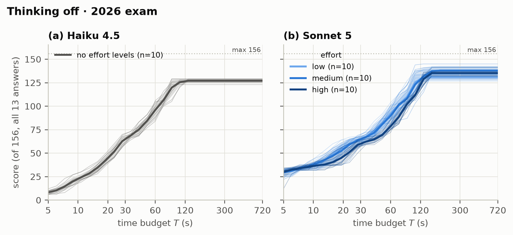

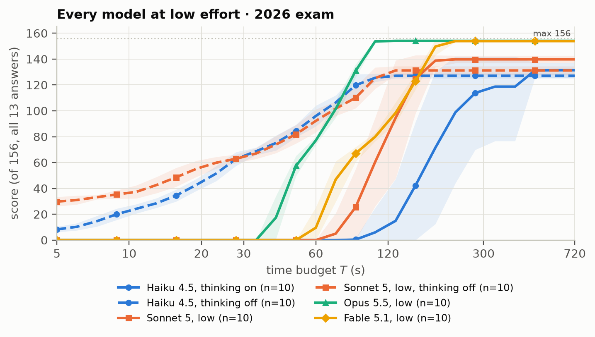

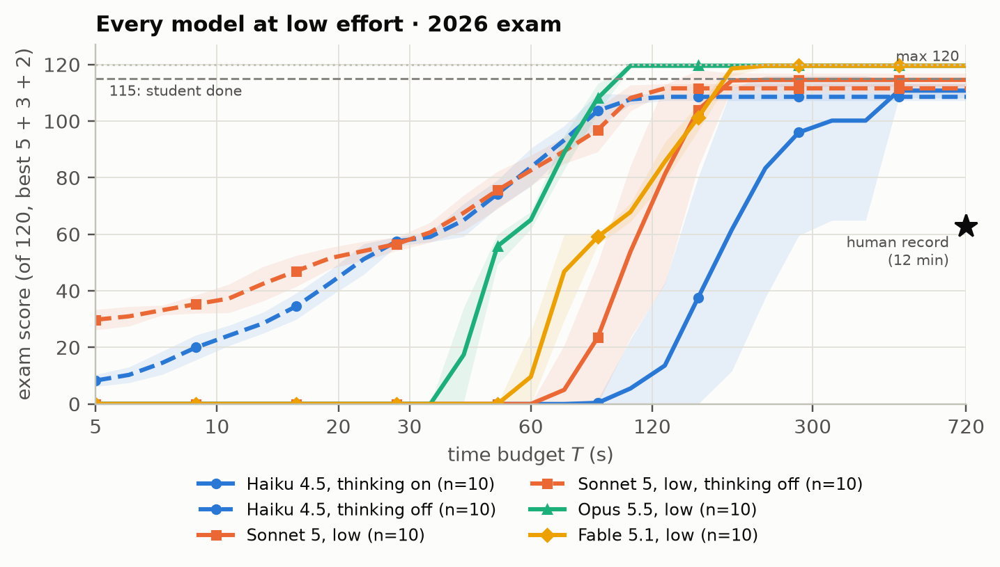

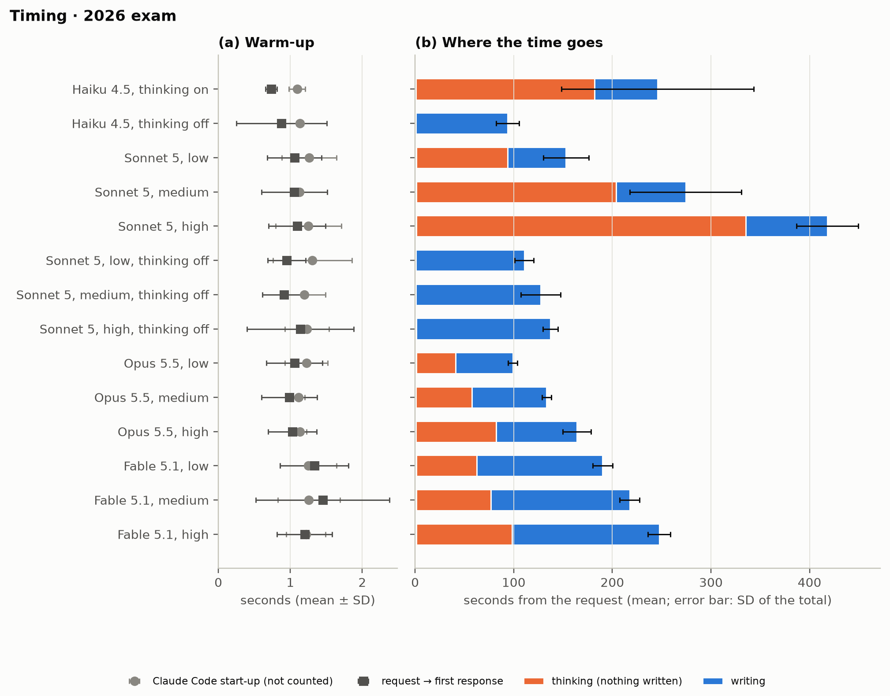

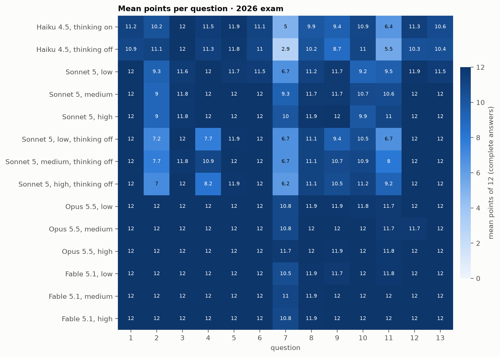

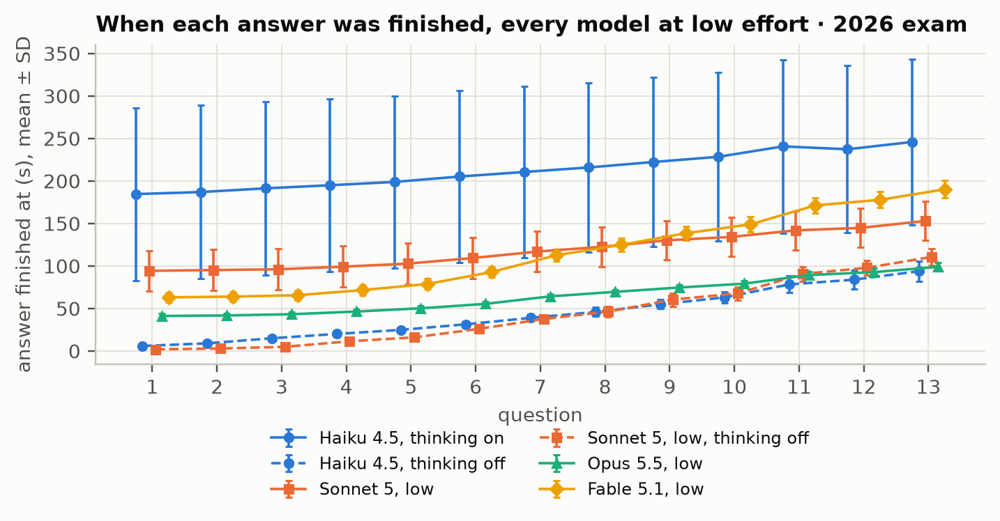

## The 2025 exam, as a control

The 2025 exam was run first, with the full design: 140 runs, each graded at every time budget. It is a control rather than the main result. The exam and its grading guidelines were public a year before these runs, and the training data of Sonnet 5, Opus 5.5 and Fable 5.1 extends past that, so these three models may have seen them; the training data of Haiku 4.5 ends two months before the exam[^models]. A clear drop from 2025 to 2026 for the three newer models but not for Haiku 4.5 would therefore point to memorization, although the two exams also differ in difficulty, so the comparison can only suggest, not show, whether memory played a part.

The numbers, as the mean and standard deviation over the 10 runs of each configuration:

| Configuration | First word (s) | Sheet done (s) | Score /156 | Exam score /120 | Beats 63/120 at (s) | 115/120 at (s) |
|---|---|---|---|---|---|---|
| Haiku 4.5, thinking on | 143 ± 34 | 188 ± 32 | 115.4 ± 11.1 | 99.2 ± 5.2 | 174 | – |
| Haiku 4.5, thinking off | 0.8 ± 0.1 | 86 ± 18 | 120.3 ± 3.5 | 100.9 ± 2.7 | 29 | – |
| Sonnet 5, low | 93 ± 15 | 145 ± 16 | 139.5 ± 4.4 | 114.0 ± 2.2 | 110 | – |
| Sonnet 5, medium | 143 ± 26 | 211 ± 21 | 144.2 ± 4.4 | 117.1 ± 1.8 | 165 | 227 |
| Sonnet 5, high | 269 ± 50 | 332 ± 50 | 147.9 ± 3.5 | 118.6 ± 1.1 | 296 | 394 |
| Sonnet 5, low, thinking off | 1.2 ± 0.3 | 137 ± 18 | 130.7 ± 7.4 | 107.3 ± 5.4 | 62 | – |
| Sonnet 5, medium, thinking off | 1.0 ± 0.3 | 158 ± 30 | 136.4 ± 4.0 | 112.3 ± 3.1 | 60 | – |
| Sonnet 5, high, thinking off | 1.1 ± 0.4 | 185 ± 44 | 138.3 ± 6.0 | 113.5 ± 5.2 | 64 | – |
| Opus 5.5, low | 36 ± 3 | 88 ± 4 | 152.9 ± 1.0 | 120.0 ± 0.0 | 49 | 82 |
| Opus 5.5, medium | 51 ± 8 | 110 ± 11 | 153.7 ± 0.7 | 120.0 ± 0.0 | 65 | 105 |
| Opus 5.5, high | 73 ± 10 | 140 ± 12 | 155.2 ± 0.8 | 120.0 ± 0.0 | 89 | 134 |
| Fable 5.1, low | 60 ± 8 | 143 ± 12 | 154.1 ± 1.1 | 120.0 ± 0.0 | 78 | 135 |
| Fable 5.1, medium | 74 ± 9 | 169 ± 13 | 153.5 ± 1.9 | 119.8 ± 0.6 | 95 | 155 |
| Fable 5.1, high | 104 ± 7 | 205 ± 6 | 154.1 ± 1.4 | 119.9 ± 0.3 | 126 | 188 |

The last two columns are read off the mean curve, and a dash means that the mean never gets there within the twelve minutes.

On this exam, every configuration beats the human record of 63 out of 120 in under five minutes, and ten of the fourteen in under two. The fastest is Haiku 4.5 without thinking, the year-old small model, at 29 seconds, followed by Opus 5.5 at low effort at 49 seconds. Again, this is clearly a thinking artefact, and with a no-thinking Opus 5.5 with fast mode enabled (or Nvidia producing ever stronger GPUs), the current human record would probably be beaten in O(10) seconds (note however that this requires optimization; AI completing the six tasks of part A does not beat the human record, so it should skip one of the first six tasks to be faster). 

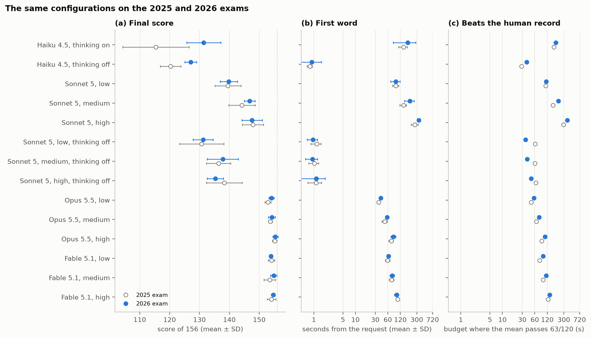

 and one curve per effort level; Haiku 4.5 has no effort levels. Faint lines are the individual runs, the thick line is their mean, and the band is one standard deviation around it, clipped to the range the runs span.")

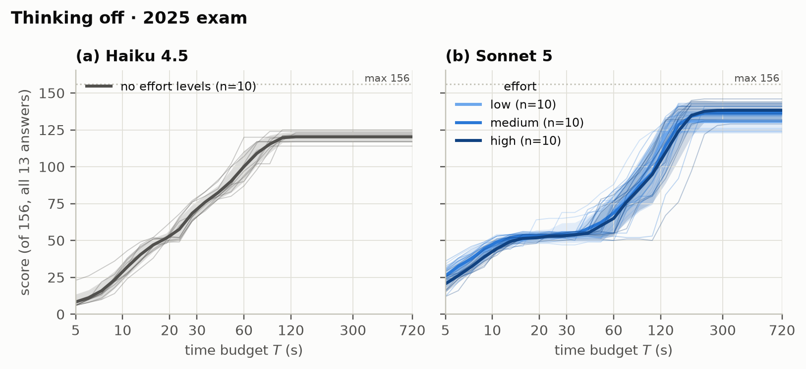

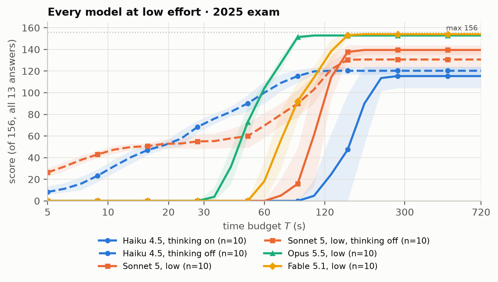

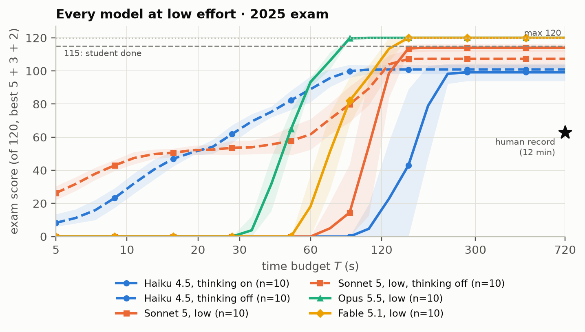

 and the time from the request to the first response. Right: stacked bars of the time from the request to the first response, the thinking and the writing, with the standard deviation of the total.")

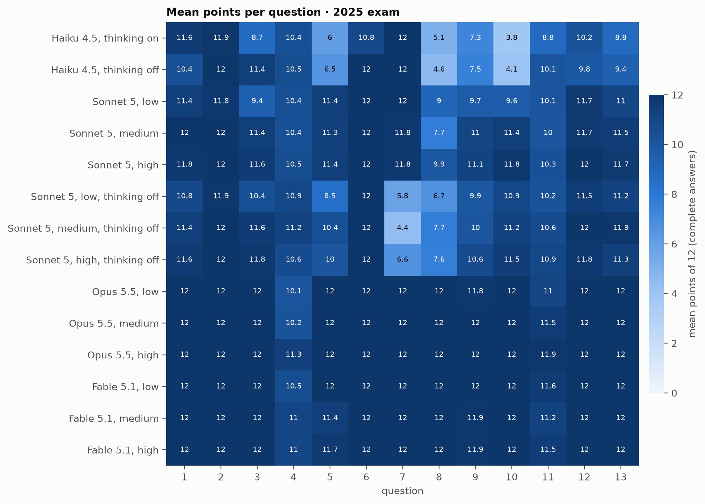

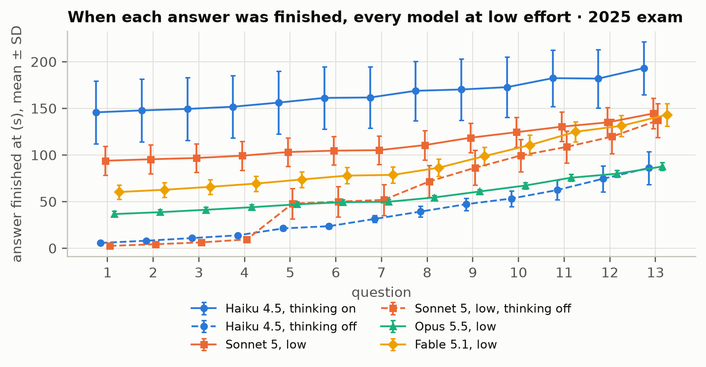

This experimental setup has been Clauded from the beginning, and I have only moderately checked the code that it has written for the test. Even if so, the codes for directly querying the models, analyzing results and grading the answers can be found openly from the code files with this post[^code].

So all-in-all, modern consumer-grade AI tools are currently at the transition of saturating the exam with a one-shot prompt without any tools, extra agent-type guides or additional information given on the exam. The quickest models with fast mode can beat the current human record in the low O(10) seconds.

## Experimental setup in detail

**The exam and its transcription.** The autumn 2026 long math exam, and the autumn 2025 exam as a comparison, as published by Yle Abitreenit[^exam], together with their grading guidelines, hyvän vastauksen piirteet (HVP)[^hvp]: the final ones for 2025, and for 2026 the preliminary ones published on the day of the exam. For the models, both PDFs were converted into Markdown with LaTeX math, keeping the Finnish text as it is. The conversion was checked by a separate model proofreading both files against high-resolution images of the original pages, symbol by symbol for the math and word by word for the text. Only interface elements were left out: page headers, the table of contents, empty answer boxes and the panel for submitting part A. The drop-down options of question 1 are written out inline. In the transcription every question is a `## N. Title (12 p.)` heading under a `# A-osa`, `# B1-osa` or `# B2-osa` heading, and the guidelines file has the same structure, so that each question's guidelines can be cut out by its heading; the general part of the guidelines is everything before the first part heading. The HVP restates each question's text before its scoring table, so the grader sees the question. The 2025 exam had no attached materials and no figures. The transcriptions themselves are not published here; the exam and the guidelines are on Yle's pages linked above.

**The 2026 exam and its material.** The 2026 exam and its guidelines went through the same procedure on the evening of the exam day. The exam was transcribed by Opus 5.5 and proofread by Fable 5.1, and the guidelines the other way round, each against the page images at 220 dpi, and neither proofreading found an error in the text, the math or the points. Unlike the 2025 exam, the 2026 exam has material and figures, which a model reading text cannot receive as such. The data table of question 7 (material 7.A) is written into the question as a Markdown table; the students also get the same data as files for spreadsheet and mathematics software, which the models do not have. The two figures, a photo of the pizza in question 4 and the curve drawn by the clock in question 11, are replaced by descriptions in words, in brackets, that state only what is visible: for the curve, that it goes once around the centre with 11 small loops on its inside, one of them straight below the centre, and that it is symmetric about the vertical line. Material 11.A, a 15-second silent video of the clock running fast, was not offered to the models; the transcription only notes that it exists. I do not expect this to affect the results much, because the text of question 11 defines the motion of both hands completely and the video is mainly an aid for the students in grasping what is happening; the solution in the guidelines does not use it either. Question 7a asks for the data to be shown graphically, which a model answering in text cannot do beyond describing or tabulating the data, so it is up to the grader how much of the 2 points of that part such an answer earns, and the same holds for every model. One of the 140 runs, Haiku 4.5 with thinking, left question 11 out without comment; all the others answered all 13 questions. In the guidelines, two apparent misprints are kept as printed: a missing "+ 1" on the left-hand side of the last row of question 12, and "xq" for "xw" in the proof of question 13. The preliminary guidelines may still change before the final ones are published some weeks after the exam, but they give every question's solution and point rows, which is what the grading needs. The instructions to the models are the same as for 2025, word for word, including the closing line: nothing in them was adapted to the material, the figures or the graph of question 7a, so that the two exams stay comparable, and the bracketed notes in the transcription are all the model is told about what it does not get. Strictly, the sentence of the system prompt saying that the complete exam is in the message is therefore not quite true for 2026, since the video is missing.

**What the model gets.** The exam is the user message and the instructions are the system prompt. The system prompt, exactly as sent (the number of questions is filled in from the exam's metadata, the language line from the option --lang):

```text
You are sitting the Finnish matriculation examination in mathematics, advanced syllabus (pitkä matematiikka), under time pressure. The complete exam is in the user message, transcribed from the official exam into Markdown with LaTeX math.

Your answer sheet is collected at a deadline you are not told. Whatever you have written by then is graded; nothing after it is.

- The answers are graded by the official Finnish grading guidelines (hyvän vastauksen piirteet). Each question is worth 0–12 points, and a solution needs the necessary calculations or other sufficient justification and a final result, unless the question says that an answer alone is enough. Only your written answers are graded, not your internal reasoning.
- The exam's instructions on how many questions to answer do not apply here: answer all 13 questions, in the order of the exam. Every answer is graded.
- Begin every answer with a line containing only `## N`, where N is the question number. Write nothing before the first such line.
- You have no calculator, software or other tools.
- Write your answers in Finnish, the language of the exam, as plain Markdown with LaTeX math.
```

The user message is the transcribed exam verbatim, followed by a horizontal rule and one closing line:

```text
---

End of the exam. Answer all 13 questions, in the order of the exam.
```

The closing line is new since the pilot. The transcribed exam ends, as the real one does, with a bold reminder to check that the number of answers follows the exam's instructions, which is five, three and two. In the pilot, one of the seven Sonnet 5 runs at low effort answered exactly ten questions (1, 2, 3, 5, 6, 7, 9, 10, 11 and 13), the five, three and two of the exam's own rules, despite the system prompt. That the reminder caused it is an inference; I have not tested it separately. The closing line restates the instruction where the reminder is. The system prompt is unchanged from the pilot. Each run stores a hash of the system prompt and the user message, and the driver refuses to start if runs already on disk were made with a different prompt, so a configuration's runs are never mixed across prompt versions.

**Language and tools.** The exam in the original Finnish, and the answers in Finnish. No tools: no calculator and no code, even though the real exam allows software after part A and question 10 of 2025 explicitly invites it. So the model plays by stricter rules than the human contestants with their symbolic calculators.

**Configurations.** Fourteen configurations, each run $N = 10$ times per exam year, 140 runs per year.

| Group | Model | Thinking | Effort levels | Configurations |
|---|---|---|---|---|
| Thinking optional | Haiku 4.5 | on and off | none | 2 |
| Thinking optional | Sonnet 5 | on and off | low, medium, high each | 6 |
| Thinking always on | Opus 5.5 | on | low, medium, high | 3 |
| Thinking always on | Fable 5.1 | on | low, medium, high | 3 |

The effort level is Anthropic's `effort` parameter, passed to Claude Code as `--effort`; according to Anthropic's documentation it applies to every output token, thinking included, and it is supported on Sonnet 5, Opus 5.5 and Fable 5.1 but not on Haiku 4.5, which therefore runs without one. The levels xhigh and max exist too but are not run here. Thinking off means the Claude Code setting `{"alwaysThinkingEnabled": false}`, passed on the command line. Anthropic's Claude Code documentation states that thinking cannot be turned off on Opus 5.5 or the Fable models and that this setting has no effect there, and the model documentation lists thinking as always on for both, with a request that disables it rejected by the API. The pilot agrees for Opus 5.5: with the setting, Haiku 4.5 and Sonnet 5 produced zero thinking tokens, but Opus 5.5 still thought (about 3,400 thinking tokens and the first word after 32 and 35 seconds in the two runs), so the thinking-off configurations exist only for Haiku 4.5 and Sonnet 5. Sonnet 5 is the one model that runs at every effort level both with and without thinking, so it appears in both of the figures split by thinking. All runs are at standard speed; fast mode, which runs the same model faster, is a research preview for the Opus models that is not available to me.

**How a run is executed.** Each run is Claude Code in print mode on my logged-in subscription. There is no API key: the subscription and the API are billed separately, and I only have the former. The code also has a backend for the Messages API through the Anthropic SDK, which would give a cleaner clock with no CLI in between and would allow fast mode, but it is unused. The command, reconstructed from the code, is

```text
CLAUDE_CODE_MAX_OUTPUT_TOKENS=<64000 for Haiku 4.5, 128000 otherwise> $CLAUDE_BIN -p \
  --system-prompt "<system prompt above>" --tools "" --model <claude-haiku-4-5|claude-sonnet-5|claude-opus-5-5|claude-fable-5-1> \
  --no-session-persistence --safe-mode --strict-mcp-config --setting-sources "" \
  --output-format stream-json --include-partial-messages --verbose \
  [--settings '{"alwaysThinkingEnabled": false}'] [--effort <low|medium|high>] \
  < exam-with-closing-line.md
```

The user message goes in on standard input, and the process runs in a fresh, empty temporary directory, because Claude Code tells the model its working directory. `--system-prompt` replaces Claude Code's own system prompt with mine, `--tools ""` removes every tool, and `--safe-mode` with `--setting-sources ""` and `--strict-mcp-config` keeps my instruction files, hooks, skills, plugins, MCP servers and settings out, which is what Claude Code's own help text says these flags disable. The isolation matters because I have an extensive personal AI setup, and none of it may leak into the test. Claude Code's `--bare` would strip more, but it uses only an API key and never the subscription login, so it is not an option here. The environment variable sets Claude Code's output-token limit to each model's maximum output according to Anthropic's model overview[^models], 64,000 tokens for Haiku 4.5 and 128,000 for the others; Claude Code 2.1.281 caps the variable at these same values. Thinking tokens count against the limit. The pilot used 64,000 for every model, which Sonnet 5 at high effort came close to: about 51,000 tokens in the pilot, and 63,138 in the first attempt at the campaign, whose six finished runs were therefore set aside and redone with the higher limit. A run that hits the limit is flagged. The binary is a pinned copy of Claude Code 2.1.281, pointed to by the `CLAUDE_BIN` environment variable of my script, because the VS Code extension's bundled copy auto-updated in the middle of the pilot evening. Every run records the version from Claude Code's init event; all 64 pilot runs report 2.1.281.

**What Claude Code adds regardless.** Some things remain that Claude Code adds regardless, and for which I found no documented way to switch them off: the line "You are a Claude agent, built on Anthropic's Claude Agent SDK." before the system prompt, a note with my account's e-mail address, and a short environment block after the exam (an empty working directory, the operating system, the model's name and knowledge cutoff, and the date). Together they were roughly 700 of the roughly 6,400 input tokens in the pilot; the exam and my instructions are the rest. In every run Claude Code also makes a small side request to Haiku 4.5 (about 24 output tokens, from roughly 5,300 input tokens), whose purpose I could not determine, and I do not know whether it delays the actual request.

**Who keeps time.** A language model has no clock, and it cannot be told to come back in five seconds and be trusted to do so. The time limit is therefore enforced from the outside: the answer is streamed, the arrival time of every piece of text is recorded, and the answer sheet at a time budget $T$ is exactly the text that had arrived by $T$. Since the model is not told the deadline and writes its text strictly in order, a single complete run gives the answer sheet at every $T$ at once. The budget itself is exact to the millisecond; the run-to-run variation of the model's speed shows up in the score, not in the timing. Concretely, $t = 0$ is the arrival of Claude Code's `system/init` event in my Python process; the start-up before it, from spawning the process to that event, is recorded but not counted. From then on every streamed line is stamped with Python's `perf_counter` as it arrives. Reading stops at 720 seconds, the twelve minutes of the usual Cooper: the process is killed and the run is marked as cut. Runs are made from my laptop in Helsinki, so the network latency from Finland is included. In a second variant the model is told $T$ beforehand and may choose what to skip, which is closer to the real Cooper, where choosing what to answer is half the game. That variant needs a separate set of runs for every $T$, and it is not part of the report here.

**Warm-up, thinking and writing.** Every run passes through the same phases, and each one is timed separately. First Claude Code starts up; this is not counted. Then the request travels to Anthropic's servers, waits its turn and the exam is read in, until the first response arrives: this is the time to the stream's `message_start` event, and it contains the network, the queueing and the prompt processing together, since I cannot separate them. Then the model thinks, which produces nothing gradable: the time from `message_start` to the first text chunk. Only then does it write, from the first text chunk to the end of the stream, and only the writing earns points. The first two phases I cannot shorten; the thinking can be shortened with a lower effort level or, for Haiku 4.5 and Sonnet 5, switched off; and the writing is only as fast as the model's output speed, which fast mode would raise but which I do not have. In the 2025 campaign, Claude Code's start-up took 0.9 ± 0.3 seconds over the 140 runs, and the first response arrived 0.8 to 2.9 seconds after the request (means per configuration, Haiku 4.5 the quickest and Fable 5.1 the slowest), so the warm-up is a few seconds at most; the thinking and the writing are in the table of the 2025 section.

**Segmentation.** An answer starts at a line containing only `## N` (trailing spaces allowed), followed by a newline. The newline is required because at a cut the header `## 1` may be the first half of `## 10`; for the same reason a header line still arriving at the cut, that is, a final line starting with `#` and not yet terminated, is stripped before segmenting. Text before the first header is dropped, as the prompt asked for none. If a header repeats, the first occurrence counts. An answer with no text yet, and a question with no answer, scores 0. The order in which the model wrote the answers is recorded.

**Scheduling.** Round 1 runs one run of every configuration, one at a time, in a shuffled order; it checks that each configuration answers as intended and gives a solo baseline. The other nine rounds then run in parallel from one queue, in an order shuffled anew for every round with the year as the seed. The queue deliberately mixes the configurations instead of running one configuration's runs together, so that a momentary slowdown on the server cannot hit all runs of one configuration at once and make its spread look smaller than it is. In the 2025 campaign the queue ran five at a time for its first 19 runs and nine at a time for the remaining 107, after the first runs had gone through without problems (the runs in progress at the switch were stopped and redone from scratch); the 2026 campaign was run nine at a time from the start. Every run records its clock interval, and the analysis computes for every run the time-weighted number of other runs in progress during it, so the effect of the parallel runs can be checked. In the 2025 campaign there was effectively none. A failed attempt, meaning a Claude Code error or a stream that ends without an `end_turn` or `max_tokens` stop, is discarded and retried after a 30-second pause, up to three attempts, and the clock of a run never includes a retry, since each attempt is a fresh process with its own clock. Three consecutive failures stop the campaign, which in practice means a usage limit; the driver skips finished runs, so it is simply rerun later, and a single group can be run alone. None of this was needed in the 2025 campaign: all 140 runs succeeded at the first attempt.

**Grading.** Each answer is graded separately by a separate call to Opus 5.5 at the effort level xhigh, through the same isolated Claude Code command as the runs but with `--output-format json --json-schema`, which makes Claude Code return validated JSON. The grader's system prompt is this instruction, followed by the general part of the official grading guidelines, which is not reproduced here:

```text
You are an experienced grader (sensori) of the Finnish matriculation examination in mathematics, advanced syllabus. You grade one candidate answer to one question, strictly by the official grading guidelines (hyvän vastauksen piirteet) below, as an official grader would.

- Apply the question's scoring rows and the general rules and deductions exactly as written. Where the guidelines do not cover a correct solution method, award points in the spirit of the rows: an equivalent correct method earns equivalent points.
- The answer may stop abruptly, even mid-sentence or mid-formula. Grade only what is written; give no credit for steps that were not written.
- The candidate had no calculator or software. Rows satisfied by documented software use are satisfied only by equivalent work shown by hand.
- The language of the answer (Finnish or English) does not affect the grade.
- Report every scoring row you applied with the points awarded, every deduction, and the total as an integer from 0 to 12.

# General grading guidelines

<general part of the HVP>
```

The user message is the question's section of the guidelines, which includes the question's text, under a heading "Question and its grading guidelines", and the answer under "Candidate answer". The grader returns the scoring rows it applied (row, points awarded, comment), the deductions (reason, points) and an integer total, which is checked to lie between 0 and 12; a call that fails, returns malformed JSON or a total out of range is repeated after a growing pause, up to four attempts. The grader does not see which model wrote the answer, with which settings, or under which time budget; it does, however, also grade the answers of its own model, but this should make no difference. Each distinct pair of question and answer text is graded exactly once and cached under a hash of the grader version, the grader's model and effort, the question and the text, so an answer finished by $T = 60$ s carries the same grade at every later $T$, and only answers cut off mid-writing are graded again, once at every grid budget where their text differs. Grading runs after all solving is done, twelve grading calls in parallel, so it never competes with the timed runs. For the 2025 campaign this meant 2,642 grading calls: 1,636 distinct complete answers (identical answers, mostly to the answer-only questions 1 and 7, are graded once) and 1,006 cut-off ones, most of them from the thinking-off runs, whose writing spans nearly the whole curve.

The time budgets form a logarithmic grid of 27 points from 5 seconds to the 720 seconds of the Cooper, `geomspace(5, 720, 27)` rounded to three significant figures, each budget about 21 % longer than the previous one: 5, 6.05, 7.33, 8.87, 10.7, 13.0, 15.7, 19.1, 23.1, 27.9, 33.8, 40.9, 49.6, 60.0, 72.6, 87.9, 106, 129, 156, 189, 229, 277, 335, 406, 491, 595 and 720 seconds. Between the grid points the curves are interpolated linearly in the logarithm of the time. The plots show all twelve minutes, because at high effort some configurations only start writing after several minutes of thinking. Two scores are computed at every budget: the sum over all 13 answers, maximum 156, which is the primary score, and the exam score out of 120, the best five answers of part A, three of B1 and two of B2, which is what a student choosing their questions afterwards would get (assuming they manage to choose correctly) and the scale of the human record.

**Statistics per configuration.** Everything is the mean and standard deviation (with $N - 1$ in the denominator) over the 10 runs: the score on both scales at every budget and at the end, and the durations of the phases above. From the mean curve I read off the budget at which it reaches half and 90 % of the 156 points ($T_{50}$ and $T_{90}$), the budget at which the mean exam score reaches the human record of 63 ($T_{63/120}$) and the budget at which it reaches 115 out of 120 ($T_{115/120}$), the level at which a real student would count as done; a configuration whose mean never gets there has none. The structure of the answer stream is checked with the number of thinking and text blocks per run, the longest pause between text chunks after the first word, where a second round of thinking would show up, and the Pearson correlation between each answer's length in characters and its writing time, pooled over the runs. Each run is also checked for flags: fewer than 13 answers, cut at 720 seconds, the token limit reached, Claude Code system events other than status (a retry inside Claude Code, for instance), thinking tokens in a thinking-off run, and a first response slower than 10 seconds.

**Software.** Python 3.12.3, numpy 2.5.3 and matplotlib 3.11.2; the anthropic SDK 1.8.0 is imported but only used by the unused API backend. Claude Code 2.1.281, as above.

**Caveats.** According to Anthropic's model overview[^models], the training data of Sonnet 5 extends to January 2026 and that of Opus 5.5 and Fable 5.1 to June 2026, all after the 2025 exam of September 2025 and its grading guidelines, so these three models may well have seen them in training. The training data of Haiku 4.5 ends in July 2025, before the 2025 exam. **The 2026 exam, written on 24 September 2026, is after the training data of every model tested.** A model grading a model is not a human grader, however closely it follows the guidelines, and here the grader shares its model with one of the examinees. The network latency from Finland is part of the clock, and so is whatever Claude Code does between my process and Anthropic's servers, including the side request to Haiku 4.5 whose timing I do not know. Question 10 in 2025, Euclid's algorithm on two 15-digit numbers, allows software in the real exam; without it the model has to write out some thirty division steps by hand, and every run has to do so.

**The 2026 campaign.** The 2026 runs were made on the evening of the exam day, 24 September 2026, between 19.04 and 20.34, with round 1 one at a time and the rest nine at a time; all 140 runs succeeded at the first attempt. As in 2025, the parallel runs showed no slowdown: relative to each configuration's mean, the writing speed was 1.02 ± 0.06 in the 14 solo runs and 1.00 ± 0.05 in the 123 runs with six to eight others in progress (correlation −0.11). The 2,633 grading calls ran afterwards with no failures.

**Code and data.** The code is linked from this post as files, with no separate repository[^code]: the solver, the campaign driver, the grader, the exam loading and segmentation, and the analysis. The transcriptions of the exam and the grading guidelines are not published; the exams are on Yle's pages[^exam], and the grading guidelines are linked separately[^hvp].

[^rules]: Ylioppilastutkintolautakunta, "Ylioppilastutkintolautakunnan yleiset määräykset ja ohjeet", (https://www.ylioppilastutkinto.fi/sites/default/files/sites/default/files/documents/yleiset_maaraykset_ja_ohjeet.pdf)
[^cooper]: K. H. Cooper, "A Means of Assessing Maximal Oxygen Intake: Correlation Between Field and Treadmill Testing", *JAMA* **203** (1968), [doi:10.1001/jama.1968.03140030033008](https://doi.org/10.1001/jama.1968.03140030033008). The original Cooper test: run as far as you can in 12 minutes.
[^cooper-rules]: "Pitkän Matematiikan Cooperin viralliset säännöt ja ohjeet", [PDF](pmcsaannot.pdf), in Finnish.
[^exam]: Yle Abitreenit, "2025 syksy: matematiikka, pitkä oppimäärä", <https://yle.fi/a/20-10008905>. The exam itself: <https://yle.fi/plus/abitreenit/2025/syksy/matematiikka_pitka/index.html>. Autumn 2026: "2026 syksy: matematiikka, pitkä oppimäärä", <https://yle.fi/a/74-20233224>. The exam itself: <https://yle.fi/plus/abitreenit/2026/syksy/matematiikka_pitka/index.html>, with the material at <https://yle.fi/plus/abitreenit/2026/syksy/matematiikka_pitka/attachments/index.html>.
[^hvp]: Lopulliset hyvän vastauksen piirteet, matematiikka, pitkä oppimäärä, syksy 2025, [PDF at yle.fi](https://yle.fi/plus/abitreenit/2025/syksy/matematiikka_pitka/matematiikka_pitka_hvp_lopullinen.pdf). Alustavat hyvän vastauksen piirteet, syksy 2026, [at ylioppilastutkinto.fi](https://tiedostot.ylioppilastutkinto.fi/kokeet/2026-09-24_M_fi/grading-instructions.html).
[^models]: Anthropic, "Models overview", <https://platform.claude.com/docs/en/about-claude/models/overview>, read on 2026-09-24: maximum output, reliable knowledge cutoff and training data cutoff of each model.
[^code]: The code: [cooper.py](code/cooper.py) (the solver), [campaign.py](code/campaign.py) (the campaign driver), [grade.py](code/grade.py) (the grader), [exam.py](code/exam.py) (exam loading and segmentation) and [analyze.py](code/analyze.py) (statistics and figures). The other saturation study files (answers of AI models and their grading for example) are available from the author upon request.
