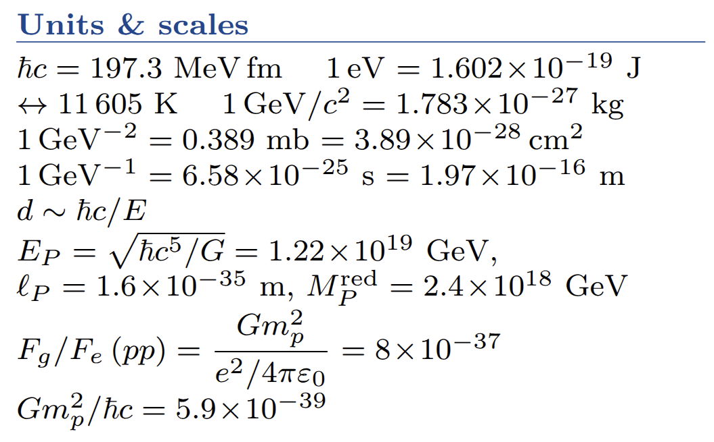

The other day I was preparing for Researchers' Night, a public outreach event where researchers explain what they do to anyone interested. Mine is theory, so I wanted the basics of the Standard Model and ΛCDM fresh in mind, and I wrapped them into this two-page cheat sheet. Whether it helps at the stand is doubtful, but outside it could be useful to someone.

Page one is particle physics: natural units and scales, the gauge principle and the Standard Model Lagrangian, charges and anomaly cancellation, the Higgs mechanism, the Z line shape, QCD, chirality and neutrinos. Page two is cosmology: Friedmann equations, thermal history, the energy budget, inflation, dark matter and dark energy, baryogenesis, and some recent numbers. If a number has a short derivation, the derivation is there too sometimes like the count of light neutrinos from the invisible Z width. Simply, the sheet includes the most quotable numbers from cosmology and particle physics with some derivations. Typos are likely, for this is Clauded, and thus corrections are as welcome as always.

[Download](cheatsheet.pdf)

