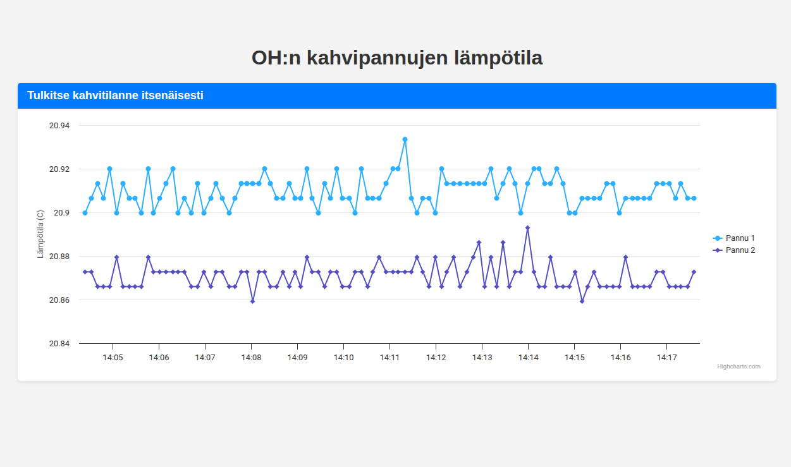

 
An IoT measurement device on the physicist student lounge to measure if coffee is ready. Simply waiting for someone to write a thermodynamics course essay on the daily variation and temperature profiles with exponential fits as coffee is consumed.

