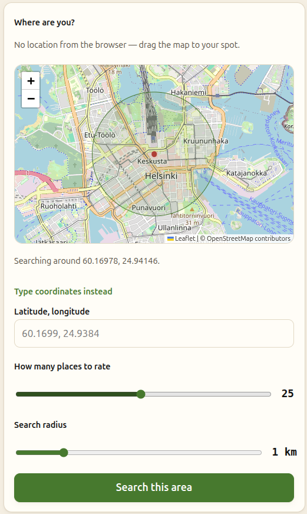

 
A vibe-coded web app to vote for a lunch place given a set of specs, in particular, the distance from the starting point and the number of restaurants. Vote by a simple majority, vetoes available for dietary restrictions etc. Hosted by Mika, check out also his [website](https://agx.fi)!

